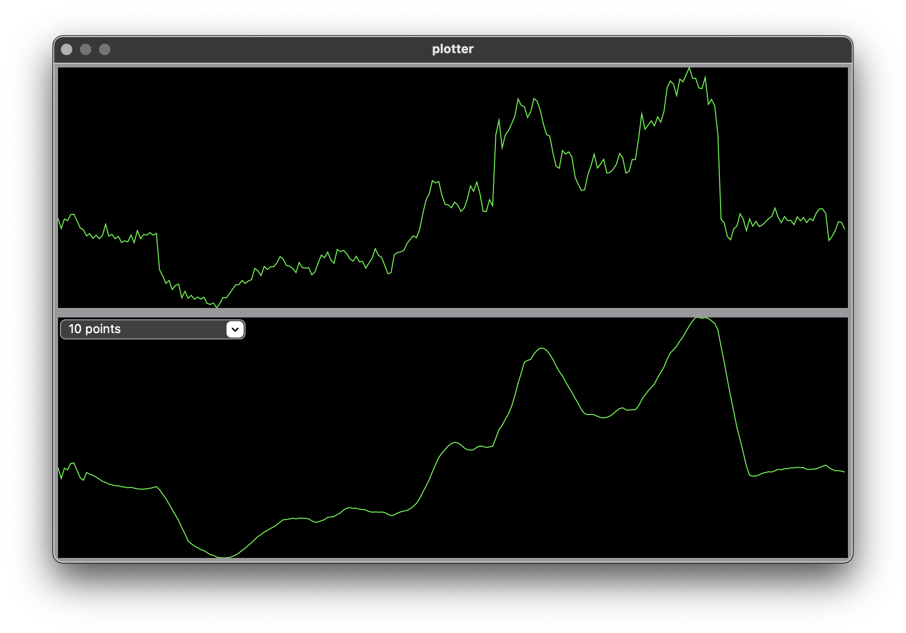

# PLT - plotter

Built from scratch a Mac OS application for plotting functions.

All written programmatically - no X Code, no Storyboard, just code.



## How to build and run
```bash
./bin/run.sh 
```

to run the unit test, use
```bash
./bin/run.sh test
```
To build only, use `build.sh` instead of `run.sh`.


## References

- [C: shared c constants in a header](https://stackoverflow.com/questions/5499504/shared-c-constants-in-a-header)
- [Obj-C: work with files](https://www.techotopia.com/index.php/Working_with_Files_in_Objective-C)
- [Obj-C: create cocoa window](https://stackoverflow.com/questions/15694510/programmatically-create-initial-window-of-cocoa-app-os-x)
